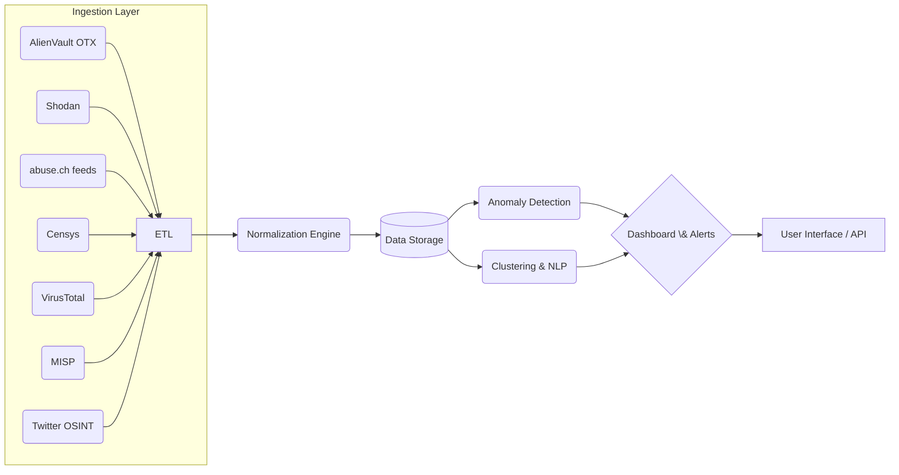

# ThreatMap – Live Cyber Attack Visualization & Prediction Engine

**Executive Summary:** ThreatMap is envisioned as a real‐time cyber attack map and predictive analytics platform. It will ingest diverse open-source threat feeds (e.g. AlienVault OTX, Shodan, abuse.ch, Censys, VirusTotal, MISP, Twitter OSINT), normalize and store the data, apply machine‐learning for anomaly detection and attack forecasting, and display insights on an interactive globe/dashboard. The value proposition lies in enabling security teams to *see* global attack trends live, correlate multiple threat sources, detect anomalies early, and predict likely next steps of attackers. This accelerates threat hunting, enriches alerts, and supports proactive defense by leveraging community and public intelligence .

## Problem Statement & Value Proposition  
Modern cyber defense demands real-time situational awareness across global threats. However, security operations often suffer from fragmented feeds and reactive analysis. *ThreatMap* addresses this by ingesting heterogeneous OSINT (open‐source intelligence) feeds into one platform. It visualizes attacks geographically and applies ML to surface anomalies or predict attack paths. The **problem** is the lack of consolidated, predictive threat views from disparate data; the **value** is in early detection of emerging threats, reduced alert fatigue, and informed decision-making. By correlating numerous feeds (community IOCs, scanning data, social signals) into one pipeline, ThreatMap turns raw threat indicators into actionable global intelligence in near real-time.

## 1. Open Threat Feeds Comparison  
The table below compares key public threat intelligence sources by access, data content, update frequency, licensing, ingestion challenges, and normalization notes:

| **Feed**            | **API Access**                                                | **Data Fields / Content**                               | **Update Frequency**                     | **License / Cost**                            | **Ingestion Challenges**                           | **Normalization Notes**                                            |
|---------------------|--------------------------------------------------------------|---------------------------------------------------------|------------------------------------------|-----------------------------------------------|---------------------------------------------------|-------------------------------------------------------------------|
| **AlienVault OTX**  | REST API (free signup; API keys); 7 endpoints (pulses, IOCs). | **Pulses** (collections of IOCs); **IOCs** (IPs, domains, URLs, hashes, CVEs) with context; **Adversaries** profiles. | Community-driven; new pulses appear daily as contributors add IOCs. | Free/community use (non-commercial); usage limits apply. Premium service for SLAs. | Variable quality of community data; duplicate IOCs across pulses. | Fields include `indicator`, `type`, `reputation`, `pulse_info` etc. Map to unified IOC schema (e.g. STIX fields like `indicator_type`, `value`, `observed_at`). |
| **Shodan**          | REST API; free key for limited queries; paid tiers for higher rate. | **Host data**: IP address, open ports, services/banners, geolocation, OS, org, hostnames, vulnerabilities (CVEs). | Continuously updated as Shodan scans the internet (live crawl). Free tier gets ~100 queries/month. | Free tier limited (monthly query credits); paid plans for high-volume and streaming. | Volume of raw scan data; frequent schema changes of banners; rate limits. | Normalize services and banners into separate records (e.g. JSON: {ip, port, protocol, banner}). Align IP lat/long from geodata into geo fields. |
| **abuse.ch Feeds**  | Websocket streams (via Spamhaus) with token-based auth. | **URLhaus**: malicious URLs/hosts, status, tags; **MalwareBazaar**: malware sample hashes, YARA, family, metadata; **ThreatFox**: malware-related IOCs (IPs, domains) with context; **YARAify**: YARA rules; **FeodoTracker**: botnet C2 servers; **Sandnet**: sandbox telemetry (network, SSL, JA3, etc). | **Real-time streams**: immediate on new data (few minutes latency). Backlog limited to minutes (no historical). | Subscription to abuse.ch real-time via Spamhaus (trial available). Data under use-agreement; free research API exists but limited. | Requires persistent websocket connection; high-volume JSON streams; parsing multiple feed schemas; potential data bursts. | Messages include `_ts` timestamp and `_idx`. Normalize by feed type: e.g. URLhaus records (url, host, reporter), MalwareBazaar (hash, filename, YARA), ThreatFox (IOC, malware metadata). Map tags/categories into standard fields.  |
| **Censys**         | REST API (free to registered users); credit-based model. | **Host Data**: banner info for IPs (services, certificates, protocols); **Web Properties**: domains with TLS, DNS; **Certificates**: X.509 details. Also vulnerability and historical results. | Internet-scale scans updated daily/weekly; free tier has shorter history (7 days vs 31 days for paid). | Free tier available (limited fields, 100K queries/month); paid plans for more data history and rate. | Handling structured JSON of host/cert data; credit limits if mass queries; field diversity (HTTP, TLS, DNS). | Normalize host services (ip, port, protocol) and web properties to match Shodan-style data. Certificates to unified `ssl_cert` object. Use STIX `ipv4-addr`, `domain`, and `vulnerability` vocabularies. |
| **VirusTotal**     | REST API; Public API (free, 500 req/day, 4/minute); Premium for unlimited. | **File/URL/Domain/IP reports**: engine scan results, metadata, community votes; **Reputation** scores. **Historical** data: subdomains, passive DNS. | Real-time analysis upon submission; daily re-scans of known files. Public API slow; Premium has SLA on new samples. | Public free (strict limits, no commercial use); Commercial (paid) unlocks full features. | Rate limits on free API; large JSON results (all AV engine outputs). | Map file/IP/domain rep. into indicator records with tags (e.g. malicious/clean). Has fields like `data.attributes.last_analysis_stats`. Link to known malware families.|
| **MISP (community)** | REST API (PyMISP library); many public MISP instances (e.g., CIRCL). | **Events**: collections of attributes. **Attributes**: IOCs (IPs, domains, URLs, hashes, emails, etc.), TTPs (tags, galaxies). Metadata: date published, org, distribution (TLP). | Updated as community submits (can be real-time or scheduled sync). Data timeliness varies by source. | Open-source (GPLv3) – no fee; users self-host or connect to feeds. Licensing flexible. | Variability in data structure; overlap between instances; trust-level differences. Some feeds have thousands of events. | Normalize MISP attributes to common IOC schema. Use event metadata as context. Many types (e.g. `type: ip-src`, `value: "1.2.3.4"`). Standardize names (TLP, Galaxy categories) as fields. |
| **Twitter OSINT**  | Twitter API v2 (free limited; paid tiers for streaming/search). | **Tweets**: text, user, timestamp, (optional geo); **Metadata**: hashtags, mentions, coordinates (if enabled). Also user profiles. | Streaming API provides real-time tweets filtered by keywords; Search API historical. Data arrival depends on query/filter. | Twitter’s API terms; free for limited use, paid for higher volume (recent changes as of 2025). Legal limits on storing/sharing tweet content. | Extremely high volume; noisy data (spamming, irrelevant chatter). Partial geolocation (few tweets geo-tagged). | Focus on security keywords (#malware, #breach) and known threat accounts. Extract mentions of indicators or new vulnerabilities. Use NLP to extract IOCs (e.g. IPs/domains). Normalize into text indicator records with context like hashtags or text embeddings. |

*Table:* Comparison of key open-source threat feeds (API access, data content, update frequency, licensing, ingestion challenges, normalization notes). 

## 2. Machine Learning Architecture Options

We consider multiple ML approaches for ThreatMap:

- **Time-series Anomaly Detection:** Treat streams of attack counts or IOC volumes as time-series. Techniques include statistical (e.g. ARIMA), machine learning (Isolation Forest on time bins), or deep learning (LSTM/Autoencoders). **Pros:** Can detect unusual spikes or drift in attack patterns; relatively interpretable (threshold anomalies). **Cons:** Requires well-structured time-series; sensitive to seasonality/drift; may flag benign traffic bursts. **Data Req.:** Historical time series of event counts (by region/port), feature-engineered (hour of day, day-of-week, normalized by baseline). **Metrics:** Precision/recall on labeled anomalies; ROC-AUC; F1. **Pipeline:** Ingest time-bucketed counts (e.g. per minute/region) → train model (e.g. LSTM Autoencoder) on normal periods → real-time scoring to flag spikes. Features: counts, deltas, moving averages.

- **Clustering (DBSCAN/K-means):** Cluster similar events or IOCs (e.g. network traffic flows or attacker IPs) to find dense groups vs outliers. **Pros:** DBSCAN finds irregular clusters and labels noise (outliers). K-means is fast for large data. **Cons:** K-means needs pre-set k and assumes spherical clusters; DBSCAN sensitive to density parameters. Unsupervised nature can reveal unknown patterns. **Data:** Represent IOCs or events as feature vectors (e.g. IP numeric, geolocation, time-of-day, service type, encoded as features). **Feature Eng.:** Scale numeric (geo coords, time); one-hot encode categorical (protocol). Possibly use autoencoder embeddings of enriched event data. **Metrics:** Cluster quality (silhouette score), detection rate of known malicious clusters. Evaluate by how well outliers correspond to known attacks. **Pipeline:** Periodic batch of new IOCs → feature extraction → cluster analysis (DBSCAN to find new clusters/outliers) → label outliers as anomalous.

- **NLP for MITRE ATT&CK Mapping:** Use NLP to map textual threat intelligence (feed descriptions, alerts, Twitter posts) to ATT&CK tactics/techniques. E.g. train a text classifier on labeled CTI reports. **Pros:** Automates tagging with known framework, enriches data; reduces manual analysis. **Cons:** Requires labeled training data (MITRE mapping); language/format variation; complex semantics. **Data:** Threat reports, tweets or log entries with descriptions of attacker behavior. **Feature Eng.:** Tokenize text, embed (word2vec, BERT). Possibly use domain-specific embeddings. **Metrics:** Precision/recall on correct technique labels. **Pipeline:** Preprocess text (clean, tokenize) → use transformer (BERT) or fine-tuned classifier against ATT&CK labels. For example, TRAM shows ML models can extract TTPs from prose. Output: attach ATT&CK IDs to events for contextual analysis.

- **LSTM/Transformer-based Attack Sequence Prediction:** Treat attack events as sequences to predict “next likely attack vector” or target. E.g., sequence of alerts from an IP or sequence of attacker steps. **Pros:** Can capture temporal dependencies and predict multi-step attacks; powerful sequence models (transformers) handle long context. **Cons:** Needs large sequence data; risk of overfitting; adversaries may not follow predictable sequences. **Data:** Labeled sequences of attacks or incidents (e.g. APT kill chains, or chronological alerts). **Feature Eng.:** Represent events as embeddings (e.g. one-hot of attack type + context features). Possibly include external context (time gaps). **Metrics:** Accuracy/F1 on next-step prediction in test sequences. **Pipeline:** Collect historic sequences (from logs or curated scenarios) → train sequence model (LSTM or Transformer) → in production, feed recent events to model → output probable next attack category or indicator.

- **Geospatial ML for Origin Attribution:** Use attacker IP geolocation plus analytics to infer attack sources or hotspots. Could use clustering of origin IPs on map, heatmaps, or Gaussian processes over geocoordinates. **Pros:** Visualizes origin trends; simple ML (KDE, clustering) easy to interpret; helps law enforcement context. **Cons:** IP geolocation is imprecise (VPNs, proxies); attribution is uncertain. **Data:** Geocoordinates from IPs (centroid lat/lng). Possibly enrich with network topology features. **Metrics:** Hard to quantify true “origin”; maybe measure geocoding accuracy vs known labels. **Pipeline:** For each alert/IP, get geo (country/city). Use clustering (DBSCAN) to find attack origin clusters; flag new source countries as potential outbreak. Display on globe. Integrate with context (e.g. historical geo patterns) for ML models (e.g. Bayesian inference on attacker location).

Each ML component would be trained/evaluated on historical threat data (e.g. Honeynet logs, threat report datasets, public IDS datasets) and tuned for precision and recall. Attack prediction models are experimental; evaluation could use held-out incident sequences. Anomaly and clustering models may use AUC or silhouette scores. 

## 3. Data Pipeline & System Design  

**Ingestion & Normalization:** Multiple feeder modules pull data (APIs, webhooks, streams) from each source. Raw JSON, CSV or text is parsed. Each feed has its own schema: for example, OTX pulses (list of IOCs), abuse.ch JSON messages, CSV lists of IPs, tweet JSON. The **ingestion layer** normalizes each into a common intermediate schema (e.g. standard IOC record with fields: `source`, `indicator_type`, `value`, `timestamp`, `context`). This may involve regex (extract IPs from text), JSON flattening, and field mapping (e.g. Shodan “ip_str” → common `ip`).  

**Storage:** Data is stored in a **hybrid database**: 
- A *time-series database* (e.g. InfluxDB) or streaming layer to handle high-volume time-stamped events (for anomaly detection).  
- A *document DB* (NoSQL like Elasticsearch or Mongo) to store raw records and allow flexible queries on IOCs/events.  
- A *graph/relational store* for relationships (adversary graphs, STIX objects).  
- Spatial (Geo) storage for geo-data (PostGIS or specialized geo-index) to support the globe visualization.  

**Real-time vs Batch:** Ingestion runs continuously (websockets, streaming APIs) for feeds like abuse.ch and Twitter. ETL jobs handle periodic pulls (e.g. hourly for Shodan/Censys data). Real-time data feeds feed ML inference pipelines (anomaly scores) immediately, while heavy models (e.g. retraining Transformers) run in batch.

**Scalability:** Use microservices and message queues (e.g. Kafka) for decoupling. Ingestion services push normalized data into a queue for processing. Storage scaled horizontally (Elasticsearch cluster, distributed TSDB). Containerized workloads (Docker/K8s) can scale ML services and dashboards.

**Privacy/Legal:** Ensure compliance: do not ingest personal data unlawfully. E.g., Twitter content must follow API terms (delete if requested) and GDPR (user consent for EU data). Use geolocation only at coarse granularity. Restrict who sees raw sensitive intelligence (maybe role-based access, anonymize PII). Include audit logs for data usage. Avoid storing full message texts beyond what is allowed.

**Alerting/Subscription:** Analysts can subscribe to alerts by criteria (e.g. new IOC in their network’s country). The system pushes alerts (email, webhook) on anomalies or specific feeds. A subscription service watches normalized data and ML scores, triggering notifications when thresholds or queries match.

*Mermaid Diagram:* Simplified flow of data ingestion through normalization into storage, feeding into ML modules, and finally dashboards/alerts. Data flows from each feed into ETL, normalized, stored, analyzed, and visualized.

## 4. Visualization Tech Stack Options

For an **interactive 3D globe** showing live attacks, several libraries exist:

- **CesiumJS**: An open-source WebGL library for high-performance 3D globes/maps. Advantages: supports real terrain and CZML time-series animation, rich controls, and world-scale precision. Disadvantages: heavier weight, steeper learning curve, and some mapping data (Cesium World Terrain) requires token (limited without subscription).  
- **deck.gl (Uber)**: A WebGL data viz framework (built on React) with experimental globe support. Pros: GPU-accelerated, easy React integration, can overlay large geospatial datasets. Cons: globe mode is still marked *experimental*: no camera tilt/zoom beyond a certain level, and lack of some advanced 3D features. Better for 2D/3D map hybrid visualizations (e.g. arc layers).  
- **Three.js / WebGL Earth**: Custom globe built from scratch (using equirectangular globe). Pros: full control over visuals; free assets (Mapbox may be used). Cons: must implement a lot manually (globe projection math, data layers), lower-level than Cesium.  
- **Mapbox GL JS**: Primarily 2D map but supports globe projection (WebGL). Attractive styling but now proprietary (requires license past certain usage).  
- **Leaflet (with plugins)**: 2D only, simpler to use, many mapping plugins. For globe, could combine with WebGL plugin (not as smooth).  
- **NASA WorldWind**: Older open-source globe. Less active development.  

For **dashboards**, common stacks include: 
- **Kibana/Grafana**: If using Elasticsearch/Prometheus, these provide geospatial map plugins and charting, quick to deploy. Good for alert dashboards but less custom interactivity.  
- **Custom Web UI**: Using React/Vue with D3.js or vis libraries (like chart.js, Vega-Lite). Offers full control for mixed charts (time-series graphs, tables, maps).  
- **Kepler.gl** (Uber): Great for large geodata exploration (2D maps), less suited to globes.  
- **PowerBI/Tableau**: Commercial BI tools with map visuals (costly licenses, less flexible integration).  

**Trade-offs:** Cesium/WorldWind provide true 3D but are resource-intensive. Deck.gl (with Google or OpenMap tiles) can handle billions of points efficiently using WebGL. [Matom.ai analysis](#) notes **deck.gl is easier for developers** but Cesium offers richer geographic detail. For pure speed, *WebGL-based* libs outperform HTML/SVG charts for large datasets. If the audience prefers a map metaphor, Leaflet/Mapbox may suffice (with attack arcs). 

*Examples:*  The [Shield AI CyberGlobe](https://shield.ai) uses Cesium; Microsoft’s [Azure Sentinel Live Map] uses Bing/Leaflet; open platforms like *Blockspring Attack Map* use WebGL.

## 5. Implementation Roadmap & Resources

An agile roadmap might span **0–12 months** with iterative releases:

- **Phase 1 (1–2 months):** Requirements & Design. Assemble team: 1 product manager/analyst, 1 security architect, 1 data engineer, 1 ML engineer, 1 frontend dev. Define MVP scope (e.g. ingest 2 feeds (OTX, Shodan), basic map of IP attacks).  
- **Phase 2 (3–4 months):** Build core pipeline. Develop ingestion connectors (ETL) for prioritized feeds. Set up storage (elasticsearch + timeseries DB). Implement normalization and basic alert logic.  
- **Phase 3 (2–3 months):** ML & visualization. Prototype one anomaly detection model (e.g. simple threshold or clustering) and integrate Cesium-based globe with real-time data overlay.  
- **Phase 4 (2–3 months):** Expand feeds & models. Add remaining sources (abuse.ch, Censys, etc). Train/polish ML models (LSTM, NLP mapping). Build subscription/alert UI (maybe Kibana or custom).  
- **Phase 5 (1–2 months):** Testing & deployment. Load testing for scale, refine privacy/legal compliance (e.g. GDPR review), finalize UI polish. Launch MVP (global attack map + alerts).  

**Team Roles:** Product/security lead (defines scenarios, threat use-cases), Data engineers (feed ingestion, DB schema), DevOps/Backend (APIs, scaling), ML engineers (models), Frontend/UI (map, dashboards), Legal/Compliance.  

**Effort & Complexity:** Moderate to high, given integration of multiple data sources and advanced ML. The **MVP** could target limited scope (e.g. showing live global attacks from one or two feeds, simple anomaly alerts) to validate concept. Each additional feed, especially streaming ones like Twitter or abuse.ch, adds complexity in ingestion and cleaning. Achieving real-time performance with ML is non-trivial. 

A rough estimate: a small team (5–7 people) working 6–12 months to a robust MVP. Subsequent enhancements (more ML, better UI, autoscaling) would follow.

## 6. Risks, Adversarial Threats & Ethics

- **Data Poisoning:** Public threat feeds can be manipulated. Malicious actors could inject false IOCs (e.g. poisoning MISP or Twitter) causing the system to learn wrong patterns or raise false alarms. Mitigation: cross-validate IOCs across multiple sources; use trust/scoring for feed sources; continuously monitor model output for drift. As IBM notes, poisoning training data can cause ML to miss threats.  
- **Adversarial ML:** Attackers might craft inputs to evade anomaly models or to trigger false positives. For example, sending benign patterns that mimic anomalies to overwhelm detection. Employ adversarial testing of ML models and ensemble methods for robustness.  
- **Privacy/Legal:** Ingesting social media or personal data (e.g. geolocated tweets) carries compliance risk. OSINT must respect privacy laws (GDPR/CCPA) – e.g. anonymize user info, allow users to opt out.  
- **False Attribution:** Geospatial plots could mislead (e.g. as a user notes, IPs often use proxies). Visualizing attack origins may inadvertently stigmatize regions. Provide context (e.g. "IP geolocation inferred – unverified").  
- **Ethical Usage:** Ensure ThreatMap is used ethically – not for unwarranted surveillance. When visualizing attacks, use coarse location (country-level) unless data is precise. Comply with each data source’s terms (e.g. Twitter’s prohibition on publishing raw content).  
- **Bias in Models:** ML models trained on historical data may over-emphasize prevalent threats (e.g. older malware) and under-detect novel attacks. Regularly retrain with new data. Provide human oversight for critical decisions.  
- **Security of the Platform:** As a threat-intel system, ThreatMap itself could be targeted. Protect the infrastructure (secure APIs, encrypted storage) and validate all incoming feed data to prevent injection attacks.

## 7. References (Key Sources)

1. ***abuse.ch Real-Time Threat Feeds (Spamhaus Tech)*** – documentation of URLhaus, MalwareBazaar, ThreatFox, YARAify, Feodo, Sandnet feeds.  
2. ***MITRE TRAM (Threat Report Attack Mapper)*** – open-source project for NLP-based ATT&CK mapping.  
3. ***Obsidian Security Blog*** – analysis of identity attacks via proxy IPs (emphasizes that IP geolocation can be deceptive).  
4. ***New America (OSINT & Privacy)*** – discussion of privacy/legal issues in open-source intelligence.  
5. ***AlienVault OTX API (Parse.bot)*** – overview of OTX API endpoints and data (IP, domain, hash queries).  
6. ***Shodan API (StackOverflow)*** – details on free API usage limits (100 queries/month).  
7. ***Censys API Docs*** – official documentation of Censys data access and plan differences.  
8. ***VirusTotal API Docs*** – public vs premium API limits (500 req/day) and data returned.  
9. ***IBM ThinkBlog on Data Poisoning*** – explanation of data poisoning risks for ML (e.g. poisoning malware detection models).  
10. ***Matom.ai (Cesium vs deck.gl)*** – comparative analysis of 3D globe viz libraries.  

These recent sources (2019–2024) provide technical and conceptual grounding for the ThreatMap design. Additional authoritative info from official docs was cited throughout (see above).

