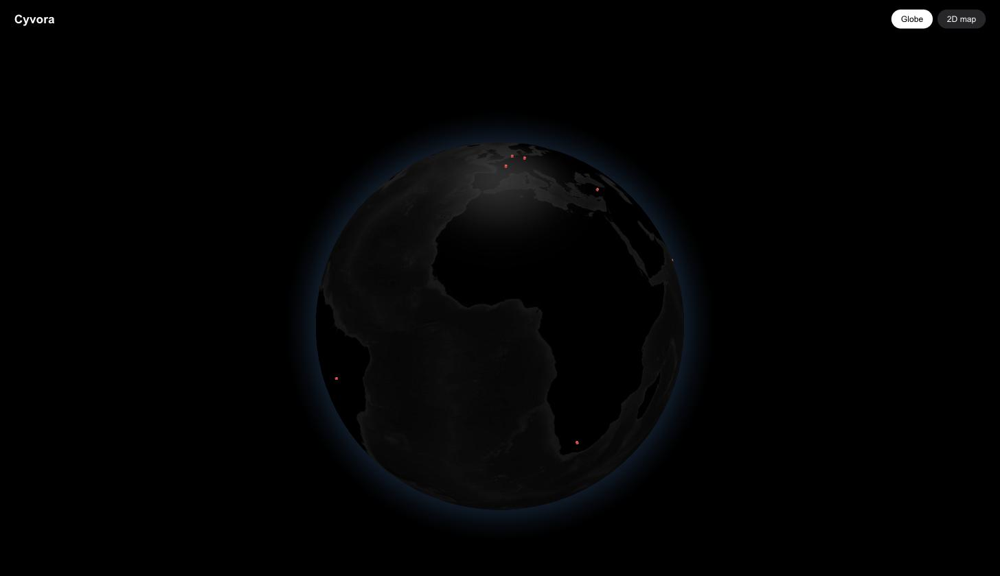
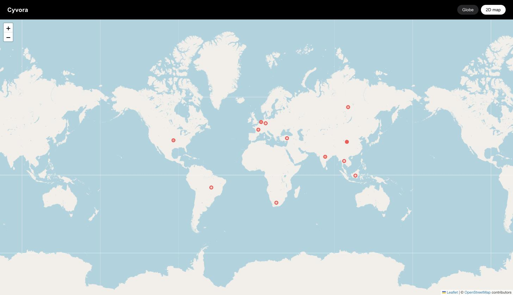

# Cyvora

A live, self-hostable open-source-threat-intel aggregation and anomaly-flagging dashboard. Ingests free OSINT feeds (abuse.ch URLhaus/Feodo Tracker, CISA KEV, AbuseIPDB), normalizes them into a common IOC schema, and visualizes them on a globe/2D map — built primarily as a cloud/DevOps engineering showcase, with statistical anomaly detection as an honestly-scoped secondary layer.

**Start here:** [`EXECUTION_GUIDE.md`](./EXECUTION_GUIDE.md) — the live, checkbox-tracked build plan. It reconciles the two research docs below into one source of truth; where they conflict, the guide wins.

- [`GPT_Analysis.md`](./GPT_Analysis.md) — original broad system-design research (reference only)
- [`Claude_Analysis.md`](./Claude_Analysis.md) — feasibility critique and the staged MVP plan the guide is built from

## Live

**https://d2w3ir83bk8ei4.cloudfront.net**

| Globe view | 2D map view |
|---|---|
|  |  |

Plotted points are real, geo-tagged malicious IPs pulled live from URLhaus/Feodo and
enriched via AbuseIPDB. The API's `?geo=true` param pages backward through the
type-time GSI (see `backend/api/handler.py`) to always return geo-tagged IOCs, since the
daily enrichment job (capped at 400 IPs/day) runs behind ingestion volume and the newest
IOCs rarely have `geo` yet.

## Architecture

```
EventBridge Scheduler                     ┌──────────────┐
  ├─ hourly ──▶ urlhaus  Lambda ──┐       │   Browser    │
  ├─ hourly ──▶ feodo    Lambda ──┤       └──────┬───────┘
  └─ daily  ──▶ cisa_kev Lambda ──┤              │ HTTPS
                                  ▼              ▼
                        ┌──────────────┐  ┌──────────────┐
                        │  S3 landing  │  │  CloudFront  │
                        │  (raw JSON,  │  └──────┬───────┘
                        │   7-day TTL) │         │
                        └──────┬───────┘   ┌─────┴──────┐
                    s3:ObjectCreated       │ S3 frontend│
                               ▼           │  (private, │
                        ┌──────────────┐   │    OAC)    │
                        │  normalizer  │   └────────────┘
                        │    Lambda    │
                        └──────┬───────┘   ┌──────────────┐
                               ▼           │ API Gateway  │
                        ┌──────────────┐   │  (HTTP API)  │
                        │   DynamoDB   │◀──┴──────┬───────┘
                        │  cyvora-iocs │          │
                        │  + GSI, TTL  │   ┌──────┴───────┐
                        └──────▲───────┘   │  api Lambda  │
                               │           └──────────────┘
                        ┌──────┴────────┐
   daily ──────────────▶│ abuseipdb     │  confidence score
                        │ enrich Lambda │  + country geo
                        └───────────────┘

  normalizer also writes per-type daily counts to S3, which the detector reads:

                        ┌─────────────────┐
                        │ S3 _state/      │
                        │ anomaly_counts  │
                        └────────┬────────┘
                                 ▼
   daily ──────────────▶┌─────────────────┐───▶ SNS alerts topic ──▶ email
                        │ anomaly_detector│
                        │ Lambda (z > 3)  │───▶ DynamoDB cyvora-alerts
                        └─────────────────┘         │  (on-demand, 30-day TTL)
                                                    ▼
                                              GET /alerts ──▶ Browser
```

Every arrow is Terraform-managed. CI (`terraform validate` + tests) runs on every push;
`deploy.yml` applies the stack and publishes the frontend on main, authenticating through
GitHub OIDC rather than stored AWS keys.

**Data flow.** Each feed Lambda pulls its source and lands the raw JSON in S3, skipping the
write entirely when the payload hasn't changed since the last pull. The object landing
triggers the normalizer, which maps each feed's format into one common IOC schema and
writes only records newer than that feed's watermark. A daily Lambda enriches a capped
subset of IP IOCs through AbuseIPDB, adding a confidence score and country-level geo. The
API Lambda serves recent IOCs out of a GSI, and the statically-exported Next.js app plots
the ones that have geo.

**Anomaly detection.** The normalizer also records how many IOCs of each type it wrote,
appending to a rolling 30-day series in S3 — not DynamoDB, since `cyvora-iocs` has no
spare capacity (see *Cost design*). A daily Lambda reads that series and, for any type
with at least 7 days of baseline, flags today's count when its z-score exceeds 3. Flagged
spikes are published to SNS and recorded in `cyvora-alerts`, which the frontend reads
through `GET /alerts`. This is deliberately statistical, not predictive: it says *this
volume is unusual against its own history*, and nothing about what happens next.

## Cost design

The whole thing is built to run at effectively **$0/month**, and that constraint drove real
architectural decisions rather than being an afterthought:

- **DynamoDB is provisioned, not on-demand.** The always-free 25 WCU / 25 RCU applies only
  to provisioned capacity — on-demand has no free allowance at all. The one exception is
  `cyvora-alerts`: that free pool is account-wide rather than per-table and `cyvora-iocs`
  already holds nearly all of it, so a handful of alert rows a day go on-demand, where
  they round to fractions of a cent.
- **Feeds are watermarked.** URLhaus re-serves the same ~550 URLs on every poll; writing
  all of them every time was a ~$12/month line item on its own.
- **Everything expires.** 90-day TTL on IOCs, 7-day expiry on raw pulls, 7-day log
  retention — no unbounded growth anywhere.
- **A $5/month Budgets alarm** is the backstop, plus a CloudWatch alarm on DynamoDB
  throttling as the early signal that the pipeline is outgrowing the free tier.

`PHASE1_ISSUES.md` has the full audit, including the numbers behind each decision.

## Repo structure

```
infra/        Terraform (all AWS resources)
ingestion/    Feed-puller, normalizer, and enrichment Lambdas (Python)
backend/      API Lambda behind API Gateway (Python)
frontend/     Next.js app, static export (globe, 2D map, and DBSCAN cluster views)
scripts/      Frontend build-and-publish helper
```

## Status

**v1 fully deployed and live.** All 61 Terraform resources are up: all three feeds on
schedule, the S3 → normalizer → DynamoDB pipeline, the API, and both buckets. CloudFront
cleared AWS's new-account verification and is serving the frontend; the pipeline has been
observed running with 18,000+ IOCs written to `cyvora-iocs`.

**v2 in progress.** Three of four items are deployed: the statistical anomaly detector,
SNS spike alerts backed by the `cyvora-alerts` table and `GET /alerts`, and the
client-side DBSCAN Clusters view. The detector currently reports zero anomalies, which is
correct — it needs 7 days of baseline history before it will flag anything, and the
counter series only started accumulating recently. Remaining: an AlienVault OTX feed as a
fourth source, which needs a free OTX API key and at least one subscribed pulse.

See `EXECUTION_GUIDE.md` for the full checklist and `PHASE1_ISSUES.md` for the cost audit
and verification commands.
